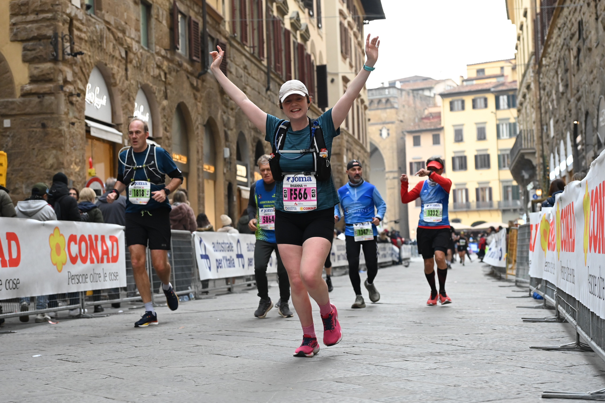

# About me 

I'm a Senior Data Scientist with over 4 years of experience working across the public sector. Most of that time has been spent at the UK Health Security Agency, where I worked on a wide range of projects including using statistical models to [forecast hospital admissions](https://researchportal.ukhsa.gov.uk/en/publications/forecasting-influenza-hospital-admissions-within-english-sub-regi/), surveillance system sensitivity modelling and free-text classification using fine-tuned language models. Most of my projects also involve building end to end reproducible analytical pipelines (RAPs) and I really enjoy the automation aspect when building any tool or analysis end point. Day-to-day I work in Python or R and have advanced experience in SQL & git. 

I came into the role through the UK Data Science in the Public Sector graduate scheme, which gave me a solid grounding in best practices, machine learning, and software engineering fundamentals. Before that, I studied for my MSci in Mathematics at the University of Glasgow, graduating with First Class Honours. My dissertation was on compartmental infectious disease modelling. In my final masters year, I also undertook modules in advanced calculus, dynamical systems and algebraic topology.

Beyond the technical side, I've always enjoyed the communication aspects of the job. That includes translating complex model outputs into clear insights for non-technical audiences as well as presenting projects at organisational meetings and cross government conferences.

I've recently made the move to the Food Standards Agency, and I'm looking forward to getting stuck into a new challenge in a different corner of government!

# About me outside of Data Science

When I'm not working, I enjoy getting outside as much as I can. I love scuba diving, hiking and running - in Nov 2024 I completed the Florence Marathon with my Brother and Father. In 2025 I took a six-month sabbatical to travel around South East Asia, which was an incredible experience.

<table>
  <tr>
    <td></td>
    <td></td>
  </tr>
</table>

<!-- <table>
  <tr>
    <td align="center"> Running</td>
    <td align="center"> Diving</td>
    <td align="center"> Travel</td>
  </tr>
</table> -->
